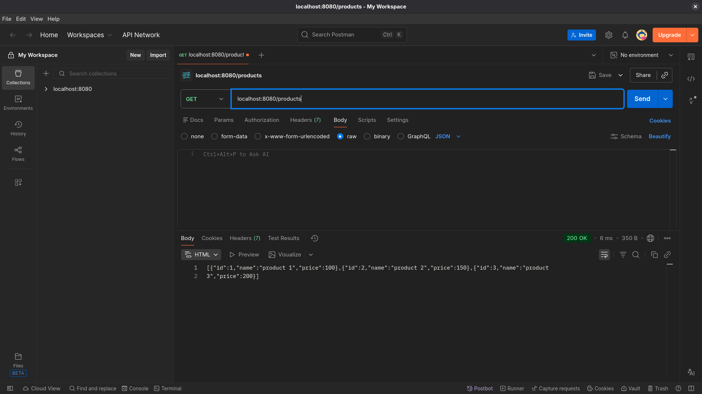

## Практическая работа 3
### Лавренов Константин Сергеевич

#### Проверка api из практической работы 2

GET запрос всех товаров

GET запрос товара по id

POST запрос добавления товара

#### api trudvsem.ru

GET запрос всех вакансий

GET запрос всех вакансий содержащих слово "разработчик"

GET запрос всех вакансий в Тульской области

GET запрос вакансий с пагинацией

GET запрос всех вакансий компаний с определенным огрн
